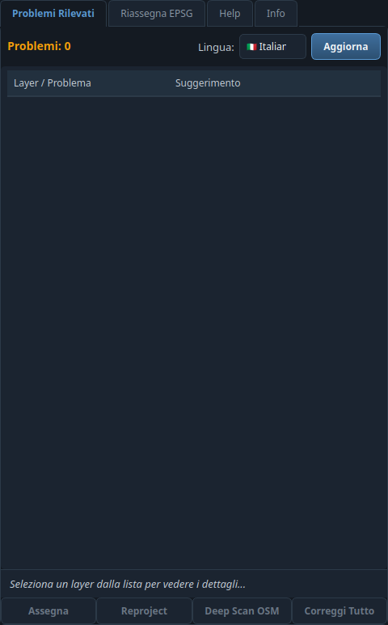
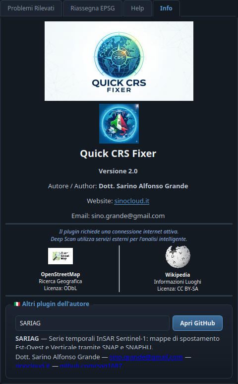

# 🧭 Quick CRS Fixer

**🌐 Lingua / Language:** [🇮🇹 Italiano](#italiano) · [🇬🇧 English](#english)

### 📸 Screenshot

| Dock principale / Main dock | Scheda Info con menù a tendina / Info tab with drop-down |
|---|---|
|  |  |

> **IT** · A sinistra il dock con l'elenco dei problemi CRS rilevati; a destra la scheda Info con il menù a tendina degli altri plugin dell'autore. · **EN** · On the left the dock with the detected CRS issues; on the right the Info tab with the drop-down of the author's other plugins.

## Italiano

### Descrizione
Quick CRS Fixer è un plugin per QGIS progettato per rilevare e correggere problemi di sistema di riferimento
coordinate (CRS) nei layer vettoriali del progetto. Il plugin controlla incongruenze tra CRS dichiarato ed extent,
suggerisce EPSG plausibili e permette di assegnare o riproiettare i layer in modo guidato.

### Cambio lingua
Nel dock è presente il selettore **Lingua** con le bandiere 🇮🇹/🇬🇧. Usalo per passare da **Italiano** a **English**.
La scelta aggiorna schede, pulsanti, Help, messaggi QGIS, problemi rilevati e suggerimenti CRS.

### Tema grafico e scheda Info
Dalla versione 2.0 il plugin adotta il tema scuro **"slate blue"** condiviso da tutta la famiglia di plugin
SinoCloud (lo stesso di SARIAG e STAC Browser). Nella scheda **Info** è presente un **menù a tendina** che elenca
gli altri plugin dell'autore: selezionandone uno compaiono la descrizione bilingue e il pulsante per aprire il
repository GitHub corrispondente.

### Workflow principali
1. Apri il dock **Quick CRS Fixer** dalla toolbar o dal menu **Vettore**.
2. Seleziona la lingua desiderata dal controllo **Lingua**.
3. Premi **Aggiorna** per analizzare i layer caricati nel progetto.
4. Seleziona un layer nella scheda **Problemi Rilevati**.
5. Leggi il suggerimento EPSG e controlla se i numeri delle coordinate sono coerenti.
6. Usa **Assegna** quando le coordinate sono corrette ma il CRS è assente o dichiarato male.
7. Usa **Reproject** quando serve creare una copia trasformata in un altro EPSG.
8. Usa **Deep Scan OSM** per cercare toponimi tramite Nominatim/Wikipedia e ottenere candidati EPSG.
9. Usa **Correggi Tutto** solo se i suggerimenti sono coerenti su tutti i layer segnalati.
10. Usa **Riassegna EPSG** per una riproiezione finale opzionale dei layer appena sistemati.

### Assign e Reproject
**Assegna** imposta il CRS corretto senza trasformare le coordinate. È la scelta giusta quando un file senza `.prj`
o con CRS errato contiene già coordinate espresse nel sistema corretto.

**Reproject** crea un nuovo layer trasformando le coordinate verso l'EPSG scelto. Usalo dopo aver assegnato il CRS
nativo corretto, oppure quando devi produrre una copia finale in un CRS di consegna.

### Deep Scan OSM
Deep Scan cerca un campo testuale utile nel layer, interroga OpenStreetMap/Nominatim e Wikipedia, quindi confronta il
centro teorico con una lista di EPSG candidati. Se trova più alternative, il menu a tendina consente di scegliere
l'EPSG prima di applicare la correzione.

### Help integrato
La scheda **Help** riporta gli stessi workflow direttamente dentro QGIS, in italiano o in inglese in base alla lingua
selezionata.

### Compatibilità e qualità codice
- **QGIS**: 3.16 o superiore, con adeguamento operativo per QGIS 4.0+.
- **PyQt/Qt**: supporto PyQt5 per QGIS 3.x e PyQt6/Qt6 per QGIS 4.0+ tramite shim Qt centralizzato.
- **Qualità**: codice controllato con flake8, inclusi W503, W504, E203 ed E126.
- **Sicurezza operativa**: timeout sulle chiamate web, logging QGIS al posto di `print`, eccezioni mirate e import
  `processing` ritardato per evitare warning in fase di caricamento.

### Servizi esterni
Il plugin può usare servizi esterni quando viene avviato **Deep Scan OSM**:
- **OpenStreetMap / Nominatim** per la ricerca geografica. Licenza dati: Open Database License (ODbL).
- **Wikipedia API** per informazioni testuali sui luoghi. Licenza contenuti: CC BY-SA.

Il plugin usa uno User-Agent dedicato e richiede una connessione internet attiva solo per le funzioni basate su servizi
esterni.

### Licenza
Il codice sorgente è rilasciato sotto licenza **GNU General Public License v2.0 (GPL-2.0)**. Vedi `LICENSE`.

### Autore
Dott. Sarino Alfonso Grande
- ✉️ **Email:** [sino.grande@gmail.com](mailto:sino.grande@gmail.com)
- 🌐 **Sito ufficiale:** [sinocloud.it](https://sinocloud.it)
- 🐙 **GitHub:** [sag1687](https://github.com/sag1687)

---

## English

### Description
Quick CRS Fixer is a QGIS plugin designed to detect and fix Coordinate Reference System (CRS) issues in project vector
layers. The plugin checks inconsistencies between declared CRS and layer extent, suggests plausible EPSG codes, and
guides the user through CRS assignment or reprojection.

### Language switch
The dock includes a **Language** selector with 🇮🇹/🇬🇧 flags. Use it to switch between **Italiano** and **English**.
The choice updates tabs, buttons, Help, QGIS messages, detected issues and CRS suggestions.

### Theme and Info tab
Since version 2.0 the plugin adopts the **"slate blue"** dark theme shared by the whole SinoCloud plugin family
(the same as SARIAG and STAC Browser). The **Info** tab hosts a **drop-down menu** listing the author's other
plugins: selecting one shows the bilingual description and a button opening the corresponding GitHub repository.

### Main workflows
1. Open the **Quick CRS Fixer** dock from the toolbar or the **Vector** menu.
2. Select the required language with the **Language** control.
3. Click **Refresh** to scan the layers loaded in the project.
4. Select a layer in the **Detected Issues** tab.
5. Read the EPSG suggestion and verify whether the coordinate values are coherent.
6. Use **Assign** when the coordinates are correct but the CRS is missing or incorrectly declared.
7. Use **Reproject** when you need to create a transformed copy in another EPSG.
8. Use **Deep Scan OSM** to search place names through Nominatim/Wikipedia and obtain EPSG candidates.
9. Use **Fix All** only when the suggestions are coherent for all flagged layers.
10. Use **Reassign EPSG** for an optional final reprojection of recently fixed layers.

### Assign and Reproject
**Assign** sets the correct CRS without transforming coordinates. It is the right choice when a file without `.prj`
or with a wrong CRS already contains coordinates expressed in the correct system.

**Reproject** creates a new layer by transforming coordinates to the selected EPSG. Use it after assigning the correct
native CRS, or when you need a final delivery copy in a target CRS.

### Deep Scan OSM
Deep Scan searches useful text fields in the layer, queries OpenStreetMap/Nominatim and Wikipedia, then compares the
theoretical center against a list of candidate EPSG codes. If multiple alternatives are found, the drop-down menu lets
you choose the EPSG before applying the correction.

### Integrated Help
The **Help** tab exposes the same workflows directly inside QGIS, in Italian or English depending on the selected
language.

### Compatibility and code quality
- **QGIS**: 3.16 or newer, with operational compatibility work for QGIS 4.0+.
- **PyQt/Qt**: PyQt5 support for QGIS 3.x and PyQt6/Qt6 support for QGIS 4.0+ through a centralized Qt shim.
- **Quality**: code checked with flake8, including W503, W504, E203 and E126.
- **Operational safety**: web request timeouts, QGIS logging instead of `print`, targeted exceptions and delayed
  `processing` imports to avoid load-time warnings.

### External services
The plugin can use external services when **Deep Scan OSM** is launched:
- **OpenStreetMap / Nominatim** for geographic search. Data license: Open Database License (ODbL).
- **Wikipedia API** for place text information. Content license: CC BY-SA.

The plugin uses a dedicated User-Agent and requires an active internet connection only for service-based features.

### License
The source code is released under the **GNU General Public License v2.0 (GPL-2.0)**. See `LICENSE`.

### Author
Dott. Sarino Alfonso Grande
- ✉️ **Email:** [sino.grande@gmail.com](mailto:sino.grande@gmail.com)
- 🌐 **Official website:** [sinocloud.it](https://sinocloud.it)
- 🐙 **GitHub:** [sag1687](https://github.com/sag1687)

### Altri plugin dell'autore / Other plugins by the author
| Plugin | Repository |
|---|---|
| **SARIAG** | [github.com/sag1687/sariag](https://github.com/sag1687/sariag) |
| **STAC Browser** | [github.com/sag1687/stac_browser](https://github.com/sag1687/stac_browser) |
| **GeoBridge** | [github.com/sag1687/geobridge](https://github.com/sag1687/geobridge) |
| **GeoCSV Mapper** | [github.com/sag1687/GeoCSV-Mapper](https://github.com/sag1687/GeoCSV-Mapper) |
| **Q-Press** | [github.com/sag1687/q_press](https://github.com/sag1687/q_press) |
| **QGIS Ledger** | [github.com/sag1687/qgis_ledger](https://github.com/sag1687/qgis_ledger) |
| **TAF Italia** | [github.com/sag1687/TAF_ITALIA_DOWNLOAD](https://github.com/sag1687/TAF_ITALIA_DOWNLOAD) |

*Copyright © 2026 Dott. Sarino Alfonso Grande — GPL-2.0*
